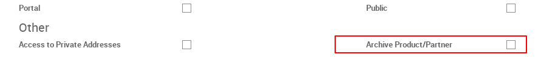
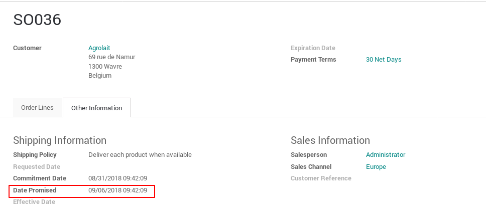
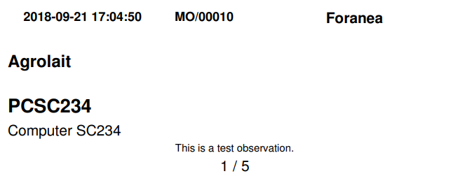
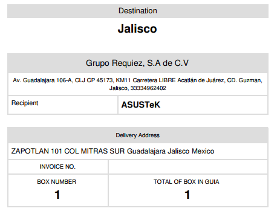
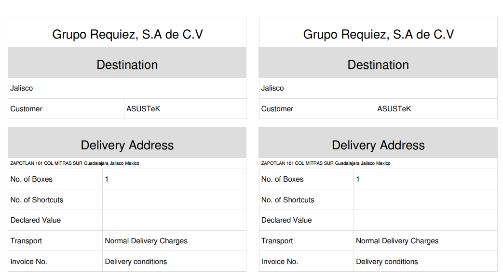
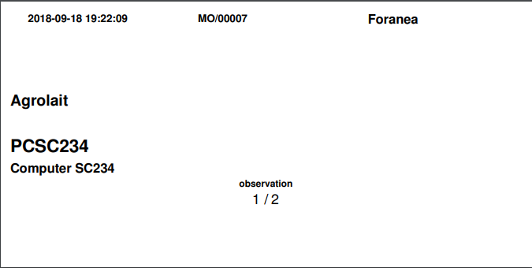

Requiez
=======

responsible_confirm_order
-------------------------
Creates a user group of sale orders responsibles that are able to confirm a order

sale_report_payment
-------------------
Adds a new menu item called Invoices to Reporting section 

sale_user_requiered
-------------------
Adds a mandatory field on quotations and orders

invoice_payment_date
--------------------
Adds date_payment field into the vendor bills

partner_credit
--------------
Allows limit partner credits

invoive_prioritize
------------------
Creates a user group of responsibles that are able to prioritize a vendor bill
Adds a field to prioritize the vendor bills

archive_product_partner
-----------------------
This allows setting access rights for any user to be able to archive a product
or a partner.

To set this access right to a user got to `Settings > Users & Companies` and
select the `Users` option, select the user you want to configure and select the
access right:

mrp_mpps
--------

mrp_upload_forecast
-------------------

mrp_report
----------

This is a report that shows all the production orders selected, ordered by 
priority.

To generate this report you must follow these steps:
- Go to `Manufacturing > Operations > Manufacturing Orders`.
- Select the orders that you want to observe in the report.
- Then select the print menu and locate the report called **Work Order Report**.

|

sale_date_promised
------------------
This modules adds the `Date Promised` field which is the product delivery date
promised to the client.

This field is the date on which the boarding area works. It is set in the sale
order and if it is not set it will take the `Commitment Date` field value.

|

|

print_label
-----------

This module adds some reports with shipping and product information so that 
the customer has knowledge of this information.

These reports are the following:

- **Inventory > Delivery Orders > Print > Product Label**

|

|

- **Inventory > Delivery Orders > Print > Shipping Label**

|

|

- **Inventory > Delivery Orders > Print > Shipping Order**

|

|

- **Manufacturing > Operations > Manufacturing Orders > Print > Product Label**

|

|

disable_autoreserve
===================

This module allows the non-reservation of merchandise with the planner.
Avoid the standard operation of odoo.
The reservation of materials when the scheduler is running is not necessary in the client's configuration.

Credits
=======

Contributors
------------
* Leandro Pacheco <leandro@vauxoo.com>
* José Morales <jose@vauxoo.com>
* Edilianny Sánchez <esanchez@vauxoo.com>
* Germana Oliveira <germana@vauxoo.com>

Do not contact contributors directly about support or help with technical issues.

Maintainer
----------

|

.. image:: https://s3.amazonaws.com/s3.vauxoo.com/description_logo.png
   :alt: Vauxoo
   :target: https://vauxoo.com
   :align: center
   :width: 400pt

