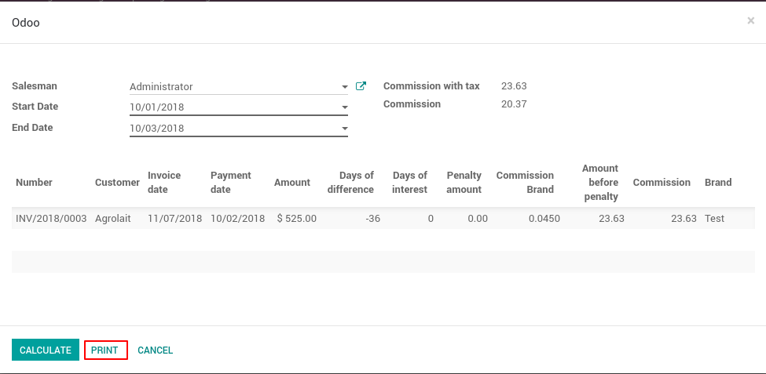

Salesman Commission
===================

This module allows to know the commission of each seller according to a date range.
Includes invoices and payments made in this date range. The commission amount
is established according to the commission brand.
A penalty amount is established, which is deducted from the commission, if the payment of the invoice is made after its due date.

Usage
=====

**Commission Setting**

A commission setting must be established, specifying the number of days the commission has and its value.

- Go to **Sales > Configuration > Commission Settings**

|

    .. figure:: ../sale_commission/static/src/img/commission_settings_menu.png
       :align: center

|

Here it can create or view the commission setting.

|

    .. figure:: ../sale_commission/static/src/img/commission_settings_new.png
       :align: center

|

**Seller Commission**

For each seller a commission is created according to a brand.

- Go to **Sales > Configuration > Seller Commission**

|

    .. figure:: ../sale_commission/static/src/img/sellercommission_menu.png
       :align: center

|

Here it can create or view the seller commissions.

|

    .. figure:: ../sale_commission/static/src/img/seller_commission_view.png
       :align: center

|

**Commission Calculation**

- Go to **Sales > Reporting > Commission Calculation**

|

    .. figure:: ../sale_commission/static/src/img/commission_calculate_menu.png
       :align: center

|

1. Select a salesman.
2. Select the start date of the calculation.
3. Select the final calculation date.
4. Press the **Calculate** button.

|

    .. figure:: ../sale_commission/static/src/img/steps_to_calculate.png
       :align: center

|

The following is shown for each invoice found:

- Invoice number.
- Client.
- Invoice date.
- Payment date.
- Amount.
- Days of difference (between the date of payment and the date of the invoice).
- Days of interest (generated by the days of difference).
- Penalty amount.
- Commission brand.
- Amount before the penalty.
- Commission.
- Brand.

|

    .. figure:: ../sale_commission/static/src/img/commission_results.png
       :align: center

|

It can also obtain a pdf document with the results by pressing the print button.

|

|

Credits
=======

Contributors
------------
* Leandro Pacheco <leandro@vauxoo.com>
* José Morales <jose@vauxoo.com>
* Edilianny Sánchez <esanchez@vauxoo.com>
* Germana Oliveira <germana@vauxoo.com>

Do not contact contributors directly about support or help with technical issues.

Maintainer
----------

.. image:: https://s3.amazonaws.com/s3.vauxoo.com/description_logo.png
   :alt: Vauxoo
   :target: https://vauxoo.com
