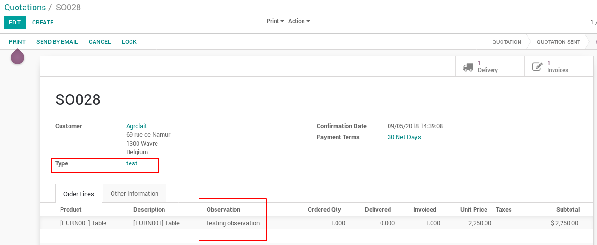
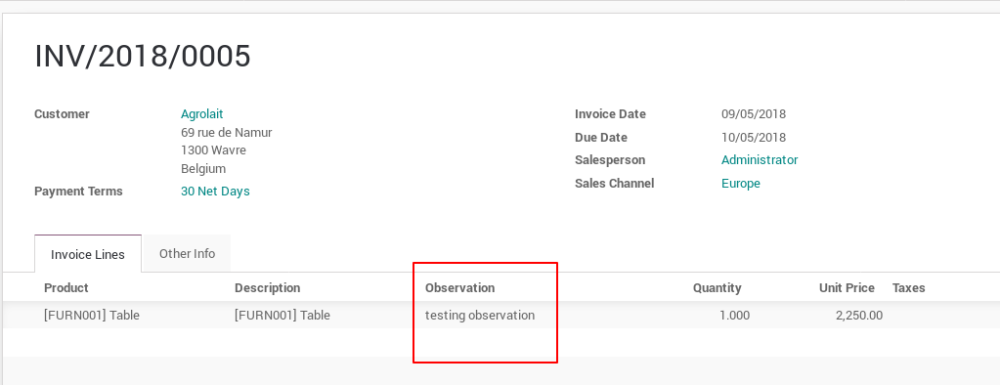
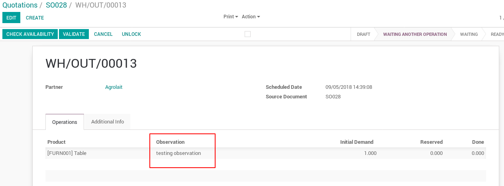
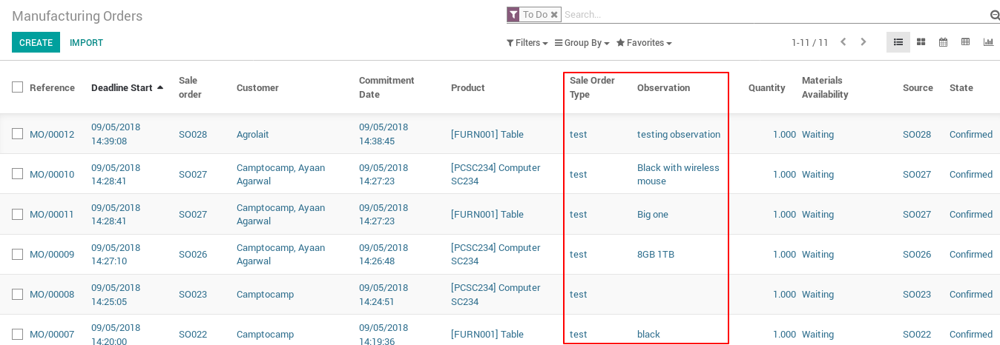

Sale Order Observation
======================

This module adds fields in different models but most relevant is that it allows
to have an observation field in each line from the sale order to the production.

Sale
----

It adds a field `Type` in the sale order and an `Observation` field in every
sale order line.

|

|

This module will also add the `Sale Order Type` menu option in `Sales > Configuration > Sales`

|

Account Invoice
---------------

It adds an `Observation` field in each invoice line.

|

|

Stock Move
----------

This module adds an `Observation` field in the picking of a sale order.

|

|

MRP
---

This module adds the fields `Observation` and `Sale Order Type` in the Manufacture
tree view.

|

